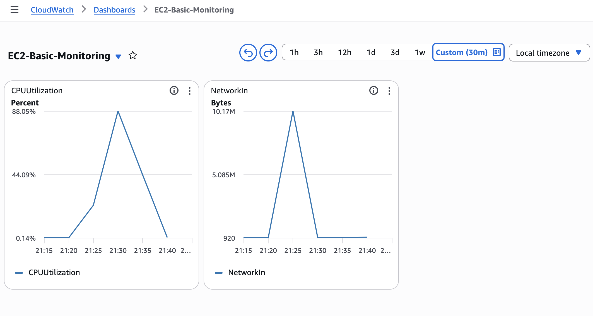
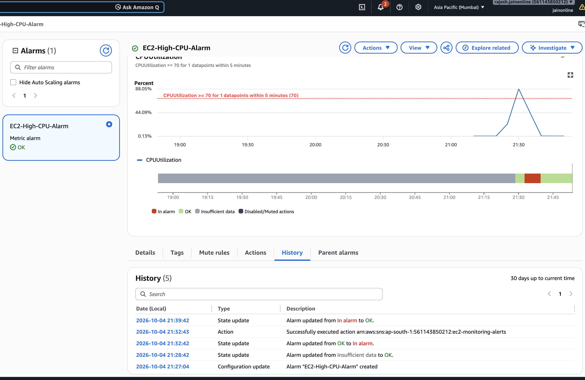
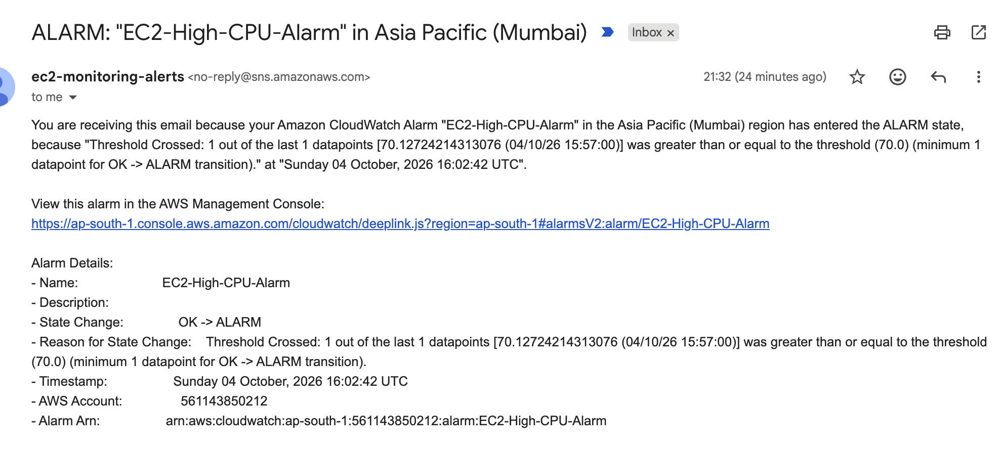

# AWS Basic Monitoring and Alerting

## Project Overview

This project implements basic monitoring and alerting for an
AWS EC2 instance using Amazon CloudWatch and Amazon SNS.

The objective is to monitor infrastructure metrics and automatically
notify the administrator when a defined threshold is exceeded.

## Architecture

EC2 Instance
     |
     v
CloudWatch Metrics
     |
     v
CloudWatch Alarm
     |
     v
SNS Topic
     |
     v
Email Notification

## AWS Services Used

- Amazon EC2
- Amazon CloudWatch
- Amazon SNS
- Email

## Metrics Monitored

### 1. CPU Utilization

Monitors the percentage of CPU being used by the EC2 instance.

### 2. Network In

Monitors incoming network traffic to the EC2 instance.

## Dashboard

The CloudWatch dashboard contains:

- CPUUtilization
- NetworkIn

## Alert Configuration

Alarm Name:

`EC2-High-CPU-Alarm`

Configuration:

- Metric: CPUUtilization
- Statistic: Average
- Period: 5 minutes
- Threshold: >= 70%
- Action: SNS Email Notification

## Threshold Selection

A CPU threshold of 70% was selected because sustained CPU
utilization above this level can indicate increased workload.

The 5-minute evaluation period helps avoid alerts caused by
short-lived CPU spikes.

## Alert Testing

CPU load was intentionally generated on the EC2 instance to
verify that the CloudWatch alarm works correctly.

The alarm changed from:

`OK -> ALARM`

An email notification was also received through Amazon SNS.

## Rollback

The monitoring configuration can be safely rolled back by:

1. Disabling/deleting the CloudWatch alarm.
2. Removing the SNS subscription.
3. Deleting the SNS topic if it is no longer required.
4. Removing the CloudWatch dashboard.

No application data or EC2 instance configuration is modified
by the monitoring setup.

## Evidence

### CloudWatch Dashboard

### Alarm Triggered

### Email Notification

## Result

The project successfully demonstrates infrastructure monitoring,
threshold-based alerting, and email notification using AWS
CloudWatch and SNS.

## Conclusion

This project demonstrates the fundamentals of observability by
allowing infrastructure issues to be detected before they are
reported by users.
